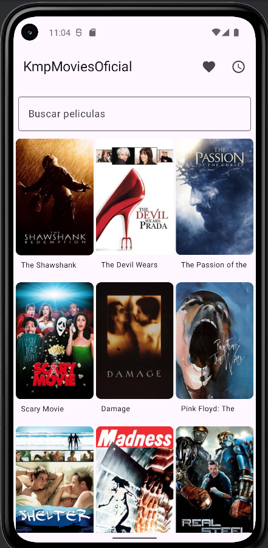
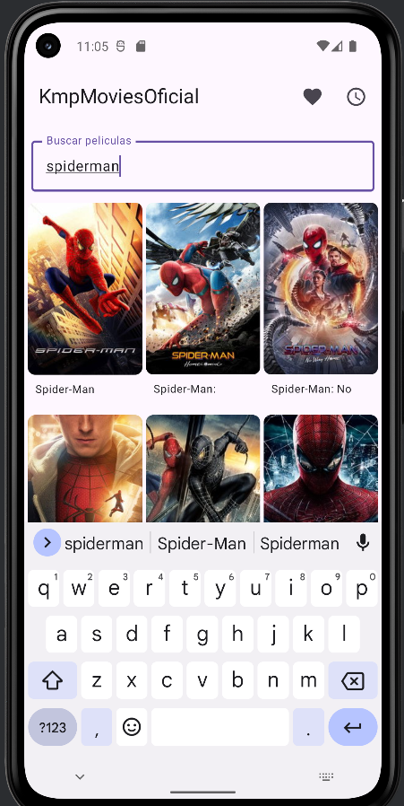
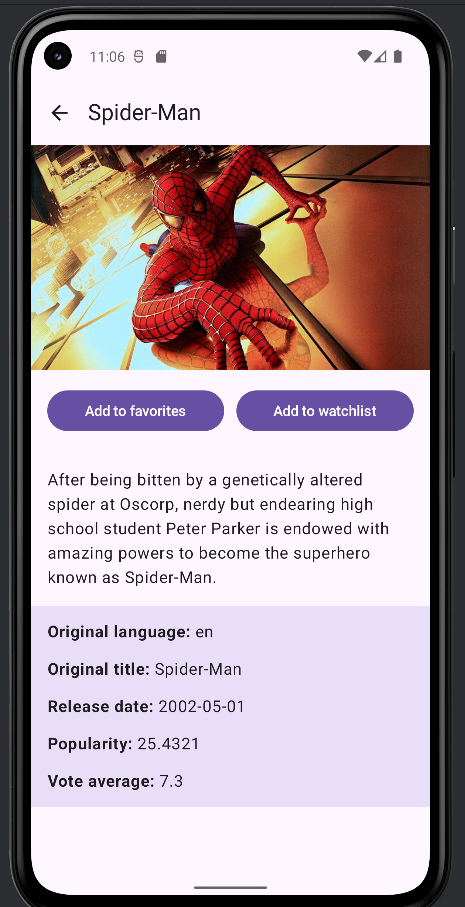
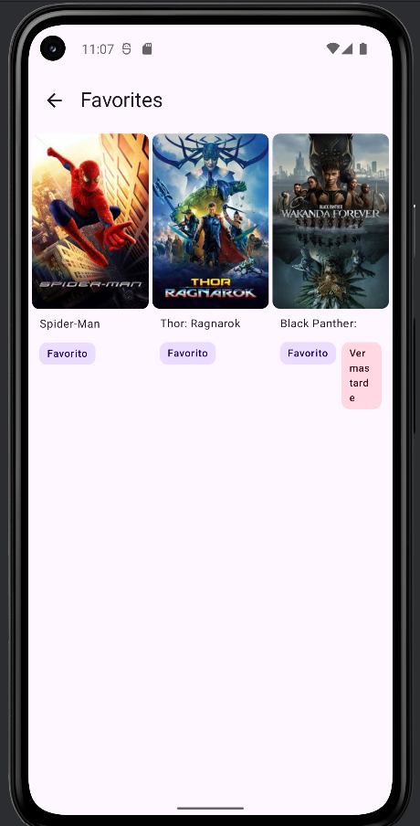
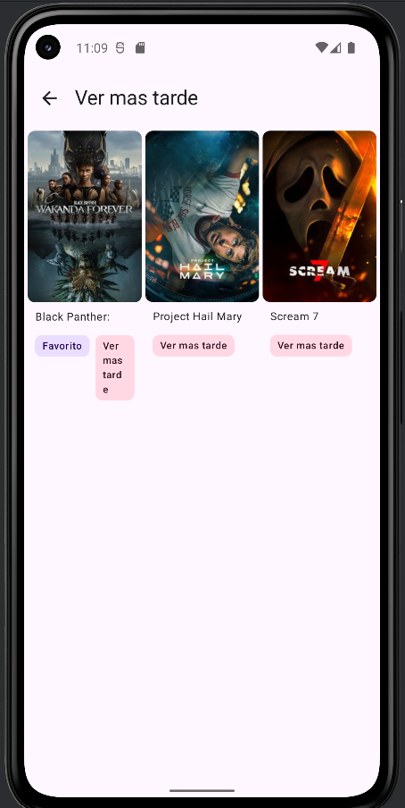

# KmpMoviesOficial

KmpMoviesOficial is a Kotlin Multiplatform movie application built with Compose Multiplatform and The Movie Database (TMDB) API.

The project shares UI, business logic, networking, persistence, and presentation logic across Android and iOS. It demonstrates a clean architecture approach using MVVM, use cases, repository pattern, Ktor, Room Multiplatform, Coroutines, Flow, and Kotlinx Serialization.

---

## Features

- Browse popular movies from TMDB
- Search movies with debounce
- View movie details, including backdrop, overview, release date, rating, popularity, and original language
- Add or remove movies from favorites
- Add or remove movies from watchlist
- Store movies locally with Room Multiplatform
- Load more popular movies with pagination
- Shared UI using Compose Multiplatform
- Shared ViewModels, use cases, repositories, and domain models
- Cross-platform networking with Ktor
- Image loading with Coil
- Loading states and reusable UI components
- English and Spanish string resources

---

## Tech Stack

- Kotlin Multiplatform
- Compose Multiplatform
- Material 3
- Ktor Client
- OkHttp engine for Android
- Darwin engine for iOS
- Kotlinx Serialization
- Coroutines and Flow
- Room Multiplatform
- SQLite Bundled
- Coil 3
- Compose Navigation
- MVVM
- Clean Architecture
- Gradle Kotlin DSL
- BuildConfig for API key management

---

## Architecture

The project follows a clean architecture style with a shared codebase inside `composeApp`.

```text
UI -> ViewModel -> UseCase -> Repository -> API / Local Database
```

Main layers:

- `data`: remote API service, Room database, entities, mappers, and repository implementation
- `domain`: business models, repository contracts, and use cases
- `ui`: Compose screens, navigation, reusable UI components, and ViewModels

---

## Project Structure

```text
KmpMoviesOficial/
|-- composeApp/
|   `-- src/
|       |-- commonMain/
|       |   |-- kotlin/io/alecrz/kmpmovies/
|       |   |   |-- data/
|       |   |   |-- domain/
|       |   |   `-- ui/
|       |   `-- composeResources/
|       |-- androidMain/
|       `-- iosMain/
|-- iosApp/
|-- gradle/
`-- README.md
```

---

## Screenshots


| Home | Search | Detail |
|------|--------|--------|
|   |  |  |

| Favorites | Watchlist |
|-----------|-----------|
|  |  |

---

## API Setup

This project uses The Movie Database (TMDB) API.

1. Create an account at <https://www.themoviedb.org/>
2. Go to Settings > API
3. Request an API key
4. Create a file named `local.properties` in the root project directory
5. Add the following value:

```properties
API_KEY=your_api_key_here
```

6. Sync the project and run the app

The API key is not included in this repository for security reasons.

---

## How to Run

### Android

1. Open the project in Android Studio
2. Add your TMDB API key to `local.properties`
3. Sync Gradle
4. Run the `composeApp` configuration on an emulator or Android device

### iOS

1. Open the `iosApp` project in Xcode
2. Add your TMDB API key to `local.properties`
3. Select an iOS simulator
4. Build and run the app

---

## Current Status

Done:

- Popular movies
- Movie search
- Movie detail screen
- Favorites
- Watchlist
- Local database cache
- Android and iOS targets

Next improvements:

- Dependency injection setup
- Better empty, error, and retry states
- Unit tests for use cases and ViewModels
- Additional movie categories such as Top Rated and Upcoming
- Real screenshots for GitHub

---

## Purpose

This project was created to practice and demonstrate production-style Kotlin Multiplatform development with shared UI, clean architecture, local persistence, and cross-platform networking.

---

## Author

Alecrz97  
Android and Kotlin Multiplatform Developer  
Open to opportunities
